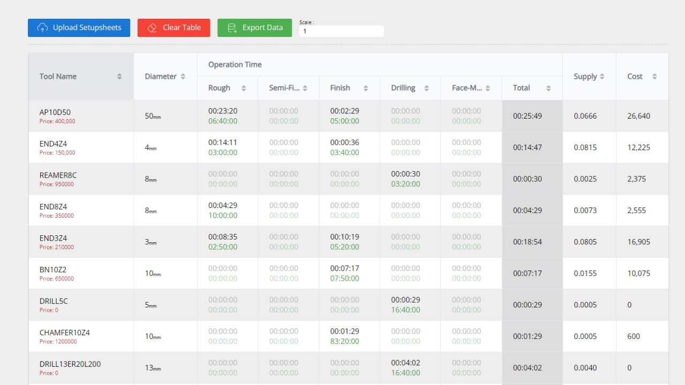

# SolidCAM Setupsheet Analyzer (SSA)

This web application allows you to analyze SolidCAM setup sheet files in HTML format. By uploading the datasheets, you can get a better understanding of the project, including estimations of the tool costs and the number of tools required. The application provides sorting capabilities to arrange the data based on your preferences.



## Naming Convention

Before using the SolidCAM Setupsheet Analyzer (SSA), it is important to follow a specific naming convention for operations. This convention ensures that the application can accurately extract and display the relevant data. The following prefixes should be used at the start of each type of operation:

```javascript
const FLAGS = {
  'Rough'        : ['R_', 'THSR', 'I3DROUGH', 'IROUGH', 'IREST'],
  'Semi-Finish'  : ['SEMI_'],
  'Finish'       : ['HSS', 'HSM', 'F_', 'P_', 'F3D'],
  'Drilling'     : ['D_', 'SPOT'],
  'Face-Milling' : ['FM_'],
};
```

For example, operation names related to drilling should start with either `D_` or `SPOT`. An example of a valid drilling operation name would be `D_Operation_1`.

> **Note**
> You have the freedom to extend the flags or add support for additional operation types. This can be done in the `/public/lib/settings.js` file.

> **Warning**
> Strict adherence to the naming convention is **essential** for the proper functioning of the SolidCAM Setupsheet Analyzer (SSA) application. Failure to follow this convention will result in the application refusing to work correctly. Therefore, it is imperative to apply the naming convention as described above.

## Usage

1. Serve the web application to run it locally. It is not recommended to open the `index.html` file directly in a browser.
2. Upload the SolidCAM setup sheet files in HTML format using the "Upload Datasheets" button.
3. View and analyze the data presented in the table.
4. Use the sorting options to arrange the data based on your requirements.
5. Estimate the cost of the tools used in the project and determine the quantity of specific tools required.

## Serving the Web Application

to serve the application you can use the following command (nodejs required):

```bash
node server.js
```

or if you want to run the server in the background run the following command:

```bash
npm ci
```

and then run the `serve.ps1` script (in linux use `bash serve.ps1`)

now you can access the app at `localhost:3000`

## Additional Notes

- The web application accepts SolidCAM setup sheet files in HTML format.
- The estimation of tool costs is based on the data extracted from the setup sheet files.
- The sorting capabilities allow you to arrange the data in the table based on your preferences.
- Make sure to specify the scale factor appropriately using the input field provided.
- The web application is designed to provide insights into the tool usage and cost estimation for SolidCAM projects.

## Contributing

Pull requests are welcome. For major changes or feature requests, please open an issue first to discuss what you would like to change.
